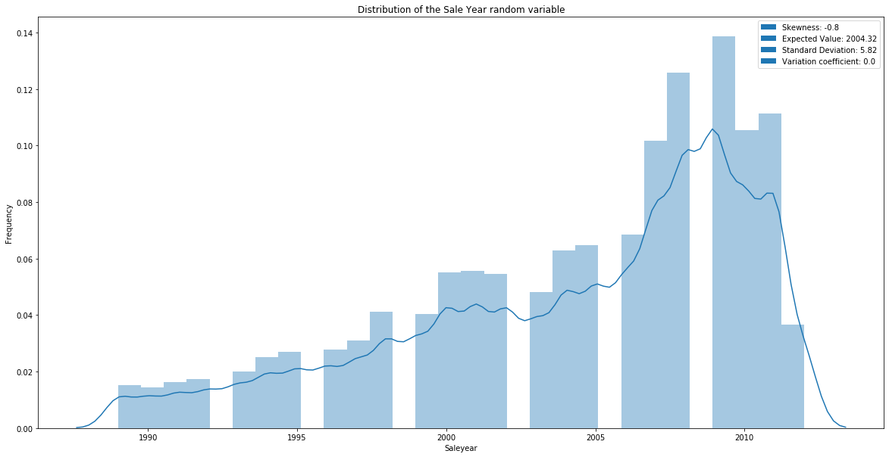
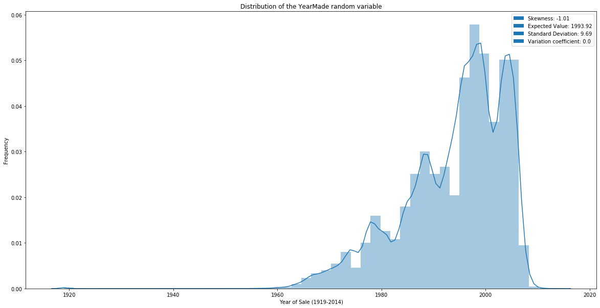

# Bulldozer-Prizing-LinearRegression
Building a linear - regression machine-learning model to predict the sales-price of a bulldozer.

## Content

* [Tools used](#tools)
* [Data used](#data)
* [Preview graphical insights](#preview-graphical-insights-from-the-dataset)
* [Work with the project](#work-with-the-project)

## Tools
The tools used in this project are:

* numpy
* pandas
* matplotlib
* scikit-learn
* Jupyter
* Seaborn

## Data

The data used in this project comes from [kaggle](https://www.kaggle.com/c/bluebook-for-bulldozers/data).

The data was part of a [kaggle - competition](https://www.kaggle.com/c/bluebook-for-bulldozers/overview) which aim was to find a suitable model to predict the prices of bulldozers.

The data is split into three different sets:

Train.csv
* is the training set, which contains data through the end of 2011.

Valid.csv
* is the validation set, which contains data from January 1, 2012 - April 30, 2012. You make predictions on this set.

Test.csv
*  is the test set. It contains data from May 1, 2012 - November 2012.

## Preview: Graphical insights from the dataset 

At this point I share some of the insights the EDA revealed. For further graphical insights please 
look into the [jupyter notebook](https://github.com/Ritsch1/Bulldozer-Prizing-LinearRegression/blob/development/notebook/Bulldozer-Pricing-Regression-Model.ipynb) or into the [plots](https://github.com/Ritsch1/Bulldozer-Prizing-LinearRegression/tree/development/plots) folder.

**Previews**

* This histogram plot shows shows the distribution of the Sale - Year variable.

* This histogram plot shows the distribution of the Manufacturing - Year variable.

## Work with the project

The [environment.yml](https://github.com/Ritsch1/Bulldozer-Prizing-LinearRegression/blob/development/environment.yml) contains the 
conda environment(the tools) being used in this project. 
There are several ways to build the environment in order to work with the notebook in this project.

1. From scratch:
* `conda create --prefix ./env pandas numpy matplotlib scikit-learn jupyter`

1. From environment.yml file:
* `conda env create --prefix -f ./env -f Path/to/yaml/file`

Each of those commands will create the environment within an env-folder relative to your current directory.

2. When you have successfully created your environment folder you can list all your environments with:

`conda env list`

3. You then have to activate the environment using:

`conda activate path/to/your/environment/folder`

If successfull, the base - prompt should change to your environment-path.

4. Then you can run `jupyter notebook` from within the anaconda prompt which should open a jupyter dashboard in your default-browser.

From that you can open the jupyter notebook and work with it.
